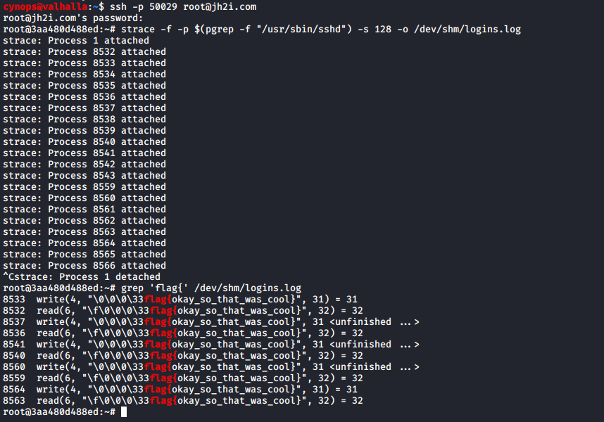

# SSH Logger

### Description

- Category:  Misc

Someone keeps logging in to this server... can you find their password?

Connect here:
`ssh -p 50029 root@jh2i.com # password is 'root'`


### Solution

We are root on the server and according to the statement an user is connecting to the server and we have to get his password.

There are two easy ways to solve this challenge:

- Backdooring the PAM library.
- Using `strace` to get all `read` system calls of the SSHD process.

Since it is a shared server, we decided not to use a backdoor since we might disturb other users  and using strace is a pretty easy way to get clear passwords for new incoming ssh connections without compile a library.

Using the following command we will attach to the sshd process and all the systems calls will be written in a file in order check the system calls `read` and `write` later but in this case we will use the grep command looking directly for the flag.

```bash
strace -f -p $(pgrep -f "/usr/sbin/sshd") -s 128 -o /dev/shm/logins.log
grep 'flag{' /dev/shm/logings.log
```


