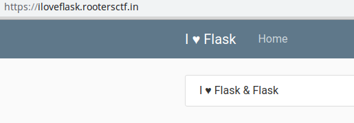
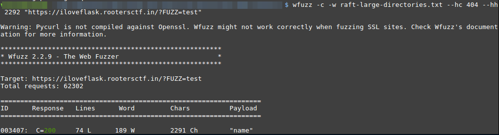
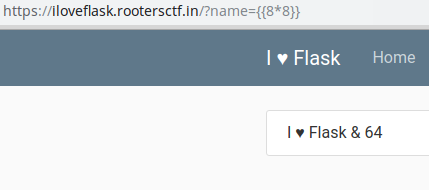
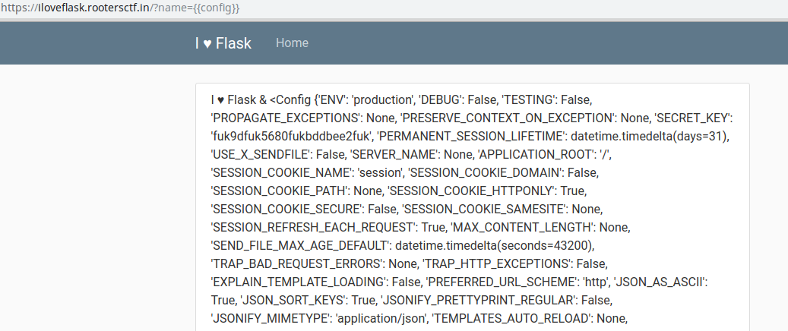
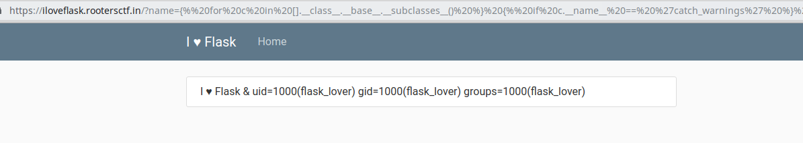
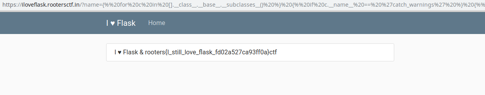

## I <3 Flask

### Description

- **Category**: Web

This challenge hadn't a description, it is just a Flask Application.

Challenge Link: [iloveflask](https://iloveflask.rootersctf.in/)

### Solution

When i entered in the web application I saw that the webapp uses Flask as a backend, these types of applications are often vulnerable to SSTI (*Server Side Template Injection*).




After reviewing the website I couldn't locate any vulnerability so I decided to try to find out if the application uses any hidden parameters, to do that I used the wfuzz tool and I discovered the parameter "**name**"

```bash
$ wfuzz -c -w raft-large-directories.txt --hc 404 --hh 2292 "https://ilovefask.rootersctf.in/?FUZZ=test"
```




Finding out the parameter I decided to test if the application was vulnerable to **SSTI** using the payload "**{{8*8}}**"



When I realized that the web application was vulnerable, I tried to find more information about the web application configuration using the payload "**{{config}}"**




After many attempts I finally managed to get the code execution in the web application getting the user who is running the web application.

```python
     {{ b['eval']('__import__("os").popen("id").read()') }}     
```




The final step was to get the flag by running "**cat /flag**" using the previous payload.

```python
     {{ b['eval']('__import__("os").popen("cat flag.txt").read()') }}     
```



> Flag:  rooters{I_still_love_flask_fd02a527ca93ff0a}ctf