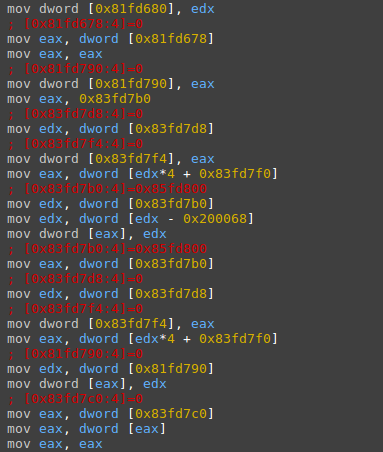
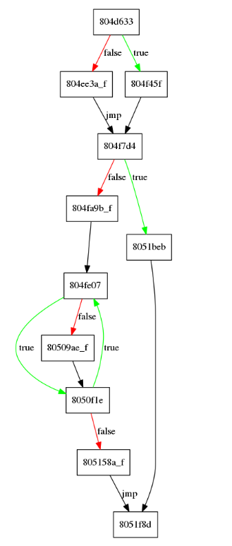
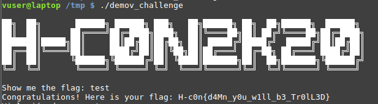
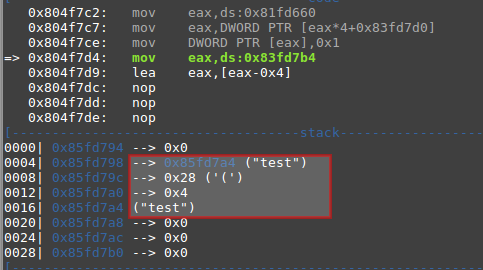
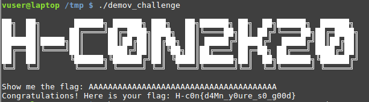

# Mov(e) the flag

### Description

- **Category**: Reversing

A hardened binary has been found, no one knows how it works. Could you guess the flag?

### Solution

The binary was compiled with [movfuscator](https://github.com/Battelle/movfuscator), so when you try to visualize the disassembly you will only see mov instructions.




These binaries are a bit difficult to analyze but there is a tool called [Demovfuscator](https://github.com/kirschju/demovfuscator), created by Julian Kirsch and Clemens Jonischkeit, that can help you with because it generates a control flow graph of the program.

```bash
$ ./demov -g graph.dot -o demov_challenge challenge
```

As you can see in the graph the flag check routine is located at the address **0x804fe07** but there is a first check located at **0x804f7d4**.



If we debug the binary it seems that in **0x804f7d4**  the length of the string entered by the user is checked. For example in our case we enter the string "test" which is four characters long and is compared with 0x28 which is 40 in decimal.






To pass the first check we enter a string 40 characters long and a new message is shown.




Our strategy now will be to introduce a breakpoint in the address  **0x8050f1e**  and create a [script]() to perform a brute force of the flag, as each time we hit a breakpoint will mean that we have found out a new character of the flag.

```python
import string
import gdb
#H-c0n{bdd0fbdbefa8e89f421140836280a5683}
# gdb -x script.py
gdb.execute("file demov_challenge")
gdb.execute("handle SIGSEGV nostop noprint pass")
gdb.execute("handle SIGILL nostop noprint pass")

class MyBreakpoint(gdb.Breakpoint):
	def stop(self):
		return True

bp = MyBreakpoint("*0x8050f1e")

flag = ''
junk = '1'
valid_chars = string.printable
for i in range(0,40):
	for char in valid_chars:
		bp.hit_count=0

		with open("flagfile", "w") as f:
			f.write(flag + char + junk * (38 - len(flag)))
			f.write('\n')
		exec_command = 'r < flagfile > /dev/null'
		gdb.write("Trying: " + char + "\n")
		gdb.execute(exec_command)

		if bp.hit_count != 0:
			_ = [gdb.execute("c") for i in range(len(flag))]

		if (bp.hit_count == len(flag)+1) and bp.hit_count != 0:
			gdb.write("[!] Found character: " + char + "\n")
			flag  +=char
			break
		else:
			gdb.write("Hits: {}\n".format(bp.hit_count))


```

